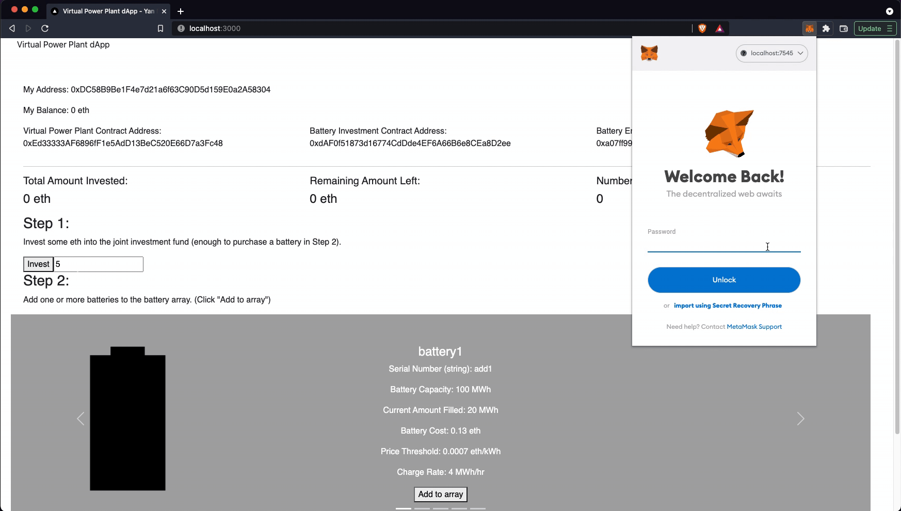
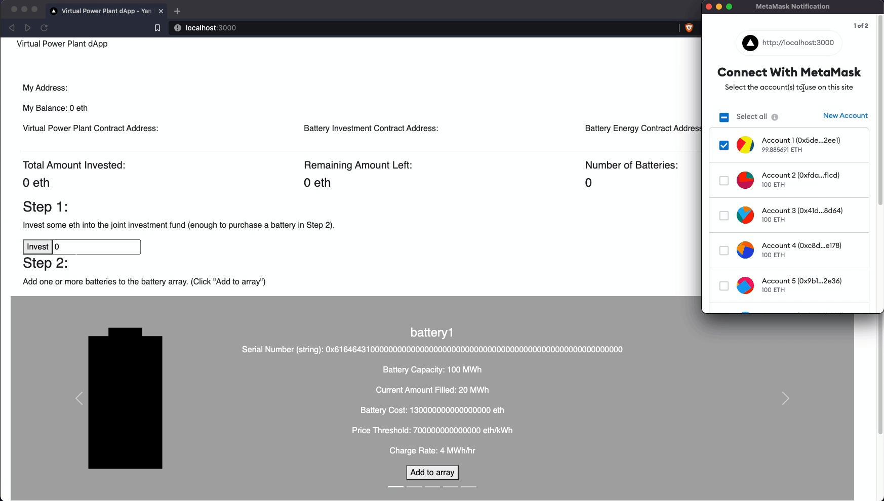
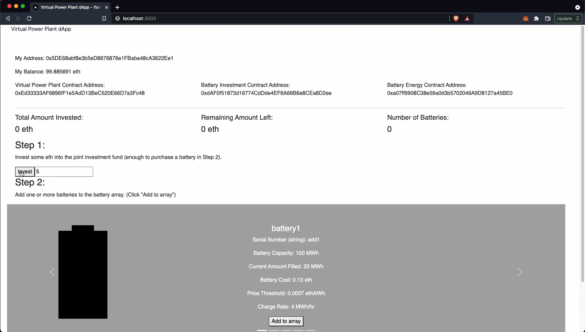
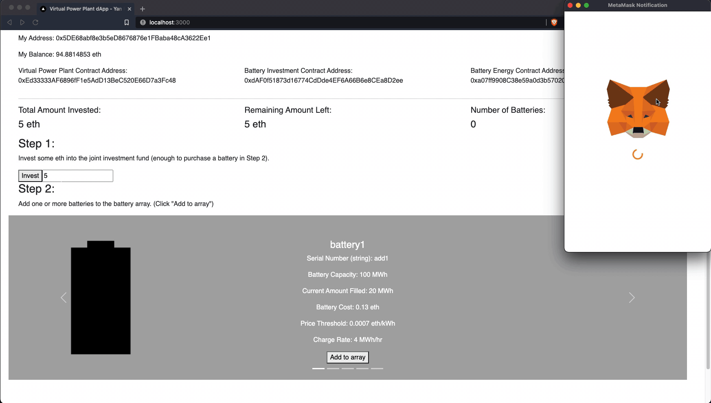

# Virtual Power Plant (VPP) dApp v0.2.0

##### VPP dApp v0.2.0 is a sample implementation of a simplified decentralized virtual power plant. It is powered by smart contracts governing fund deposits, energy-trading/arbitrage, and settlement in the form of investor dividends. It - allows users to deposit eth into a pooled group investment fund; creates the ability to manage battery assets via purchases using pooled funds; determines energy transactions based on market pricing; distributes dividends based on fund performance. This implementation also includes a sample web interface to connect with the smart contracts.

## I. Quickstart

VPP-dApp is a Truffle project that contains all necessary contract, library, migration and test files. To start the demo, start the command line:

1. Clone the repo to your directory.

   ```
   $ git clone https://github.com/yan-man/virtual-power-plant.git
   ```

2. a) In a separate terminal, start ganache development blockchain on port 7545. Create 10 funded accounts.

   ```
   Terminal 2:
   $ ganache-cli -p 7545
   ```

   OR

   b) start ganache application (in MacOS)

3. In the first terminal, navigate to the project directory. Test the contract functions via `JavaScript` tests.

   ```
   Terminal 1:
   $ truffle test
   ```

4. Migrate and compile the Truffle contract to generate the ABI and deploy the contract to the dev blockchain.

   ```
   $ truffle migrate --reset
   ```

5. Make sure `MetaMask` is installed. Open `MetaMask` in your Chrome browser and set the network connection to `Custom RPC` and the target RPC url to `http://127.0.0.1:7545` to access the `ganache-cli` accounts. Only one address is required to test the dApp.



6. Log in to `MetaMask` via `import using Secret Recovery Phrase` - copy seed phrase from Ganache.

7. Start the front end server and navigate to `http://localhost:3000/`:

   ```
   $ npm run dev
   ```

### **Web Application**:

The first development account is used to deploy the parent contract `VirtualPowerPlant.sol`. Only one development account is required for the demo.

To test the dApp, follow instructions on the `http://localhost:3000/` page.

1. `Metamask` prompt should open. Allow access on your account. If successful, contract and user address details should be updated on the page. Confirm that "My Address" and "My Balance" fields match address and balance shown in `Metamask`.



2. Start by investing some amount of `eth` (around ~5 Eth should be sufficient) into the battery. Fill in field in Step 1. Accept `Metamask` prompt; if successful, "Total Amount Invested" and "Remaining Amount Left" should be updated.



3. Once the transaction has been accepted, you can start adding batteries to the fleet. Sample battery options are listed and available, select a few to add by clicking `Add to array` under each battery panel. "Number of Batteries" field should be incremented; new carousel should pop up with green background showing newly add battery in fleet.



### Required installation

Install the following packages. The dApp was developed in the following versions in a [Ubuntu64 18.04](https://www.ubuntu.com/download/desktop) environment.

- [Solidity v0.5.0 (solc-js)](https://solidity.readthedocs.io/en/v0.5.3/)
- [Truffle v5.0.2 (core: 5.0.2)](https://truffleframework.com/docs/truffle/getting-started/installation) & [web3.js v1.6.1](https://web3js.readthedocs.io/en/v1.2.11/web3-utils.html)
- [Ganache CLI v6.2.3 (ganache-core: 2.3.1)](https://truffleframework.com/docs/ganache/quickstart)
- [npm v3.5.2](https://www.npmjs.com/get-npm) / [Node v8.10.0](https://nodejs.org/en/)
- [React v17.x](https://reactjs.org/) & [next.js v12.x](https://nextjs.org/)
- [MetaMask](https://metamask.io/) (in browser)

## II. Getting Started

### Example Usage:

If contracts have been compiled and migrated properly, there should be JSON contract files in the `/build/contracts/` directory.

- In JavaScript, you can access contracts via `web3.js` implementation. Load the `web3Contracts.js` class:

```js
import web3Contracts from "../api/web3Contracts";
```

- Initialize `web3Contracts` instance, connect to `Metamask` as provider, and initialize smart contracts with `Truffle`:

```js
const Web3Contracts = new web3Contracts();
await Web3Contracts.init();
```

You can then begin to interact with its contract functions directly via JS. Make sure there are sufficient funds invested before adding batteries to the array.

- Contract methods can be accessed with:

```js
Web3Contracts.contracts.VirtualPowerPlant.deployed.someFunction(
  parameter1,
  parameter2,
  ...{
    from: "0xuserAddress",
    value: Web3Contracts.web3.utils.toWei(amount, "ether"),
  }
);
```

- `Metamask` account addresses can be found in: `Web3Contracts.accounts`

Otherwise, interact with the dApp via the app, which will allow you to invest funds, and add batteries to fleet.

## III. Detailed Usage

### User roles:

#### 1) Admin

`admin` users are the only ones allowed to perform crucial functions. The initial account that deploys `VirtualPowerPlant.sol` is the `owner` and the first `admin`, and is able to set up other `admins`. `admins` are responsible for performing two main functions:

- Managing batteries: This consists of adding batteries to the fleet and decommissioning them when necessary.
- Managing investments: triggering dividends to pay investors, and distributing the dividends into withdrawal pools for investors to withdraw from.

#### 2) Investors

Investors are composed of any other accounts that want to contribute eth to the fund. Anyone can be an investor, and investors are eligible for dividends that are paid in proportion to the amount of funds invested.

#### Battery-related Assumptions/Calculations:

- A very simple threshold was used to determine whether energy should be purchased or sold, ie if prices were more expensive than the battery's threshold, energy was sold to the grid. Otherwise, energy was purchased.

- The real time energy price was hardcoded to simplify the transaction process. Ideally, it would be connected to an outside Oracle to report the actual, fluctuating real time energy rate.

- The actual energy transaction was simplified. Whereas in reality, a separate contract might have to be implemented to manage energy transactions between the grid and outside suppliers, in this dApp energy was assumed to be traded instantaneously and available immediately.

- Batteries were assumed to have charged instantaneously, with minimal restrictions on battery performance. In reality, charge frequency and other factors would add vastly more constraints.

- Decisions on whether to purchase or sell energy were based on a simple threshold. If energy prices are expensive (ie greater than the battery's price threshold), sell energy to the grid to make a profit. Otherwise purchase energy to charge the battery.

#### **Relevant Contract Functions**

#### 1) `VirtualPowerPlant.sol`

- `isAdmin`: check address is an admin user
- `setAdmin`: set admin to active or inactive
- `toggleContractActive`: to implement circuit breaker design

- `addBattery`: add Battery struct to fleet, composed of multiple battery characteristics. Battery
- `decommissionBattery`: render battery inactive (no charging/discharging)
- `chargeBattery`: charge battery, ie alter battery state based on amount charged/discharged
- `changeBatteryThreshold`: alter battery threshold characteristics (affects decision making on energy purchases)

**Battery info getter functions:**

- `getRelevantBatteryInfo`
- `getBatteryChargeRate`
- `getBatteryMapIndex`

#### 2) `BatteryInvestment.sol`

- `updateRemainingInvestment`: update amount of remaining eth in fund
- `investMoney`: ensure Eth is attached when calling this function
- `triggerDividend`: admins can implement a dividend to send payment to investors
- `withdraw`: for investors to retrieve their dividend withdrawal
- `getInvestorInvestment`: getter function to retrieve investment amount for particular investor

#### 3) `BatteryEnergy.sol`

- `checkBatteryEnergy`: loop over batches of batteries, check transaction circumstances for each. Transact energy as required, update the investment fund with profits/energy purchases.
- `getRealTimeEnergyPrice`: hardcoded for this demo. Retrieves the current energy rate on the real time market.
- `energyDecisionAlgorithm`: determines whether to purchase energy or sell it to the grid, based on a simple threshold.

## III. Tests:

### Contract tests were written in JavaScript

#### `BatteryInvestment.js`:

- `...check deployed contract addresses are correct`: Check deployment of the parent `VirtualPowerPlant.sol` contract, which in turn deploys `BatteryEnergy.sol` and `BatteryInvestment.sol` contracts.
- `...check BatteryInvestment public vars are set properly`
- `...check BatteryInvestment updateRemainingInvestment`
- `...check BatteryInvestment investMoney & getInvestorInvestment`
- `...check BatteryInvestment triggerDividend`
- `...check BatteryInvestment addPendingWithdrawals`
- `...check BatteryInvestment withdraw`

### Libraries

1. [SafeMath](https://github.com/OpenZeppelin/openzeppelin-solidity/blob/master/contracts/math/SafeMath.sol): Use battle tested math functions to avoid overflow errors, etc
2. [Math](https://github.com/OpenZeppelin/openzeppelin-solidity/blob/master/contracts/math/Math.sol): Other basic math functions
3. [Ownable](https://github.com/OpenZeppelin/openzeppelin-solidity/blob/master/contracts/ownership/Ownable.sol): Inherit ownership properties

## IV. Appendix

### **Motivation**

Although customers typically pay a flat energy rate for electricity throughout the day, energy prices in actuality fluctuate drastically depending on real time aggregate energy demand. Due to the unpredictability of real time demand, along with insufficient implementation and availability of large scale energy storage resources, energy response must be managed on a minute by minute basis. Electricity generators respond by activating so-called "Peaker" plants, which are convenient for short term energy generation but are also typically the most [environmentally damaging.](https://www.gogriddy.com/blog/renewable-energy/to-use-clean-energy-avoid-pollution-spewing-peaker-plants/)

With the increasing availability of flexible energy resources such as batteries, energy can be stored when real time energy demand is low, and discharged to the grid when demand, and prices, are high. This serves to effectively smooth the aggregated energy demand throughout the day, improving grid efficiency and stability as well as creating profit through energy trading.

However, given the high number of transactions per second (TPS) required to trade electricity, which is typically produced and consumed instantly, many blockchain networks are insufficient to handle such load - particularly for small quantities given high gas fees. Perhaps large entities, trading maybe MWh blocks for futures, would be open to using blockchain technologies to transact.

The Battery Investment smart contract retains utility to manage pooled funds and trigger dividends, and the Virtual Power Plant contract effectively manages a ledger of a fleet of batteries. However, the Battery Energy contract is impractical at the moment as a fully decentralized component.

### **Smart Contract Improvements**

- **[Oraclize](https://docs.oraclize.it/)**: There are two obvious ways to improve this contract implementation -

  - Run energy transactions every hour or on a regular time interval. This removes the manual component of transactions. This requires implementation of a regularly scheduled CRON job.

  - Find the actual real time energy price during each transaction. Currently this energy rate was hard coded to a sample value. Pulling real rates requires oracle data off-chain.

- **Energy optimization algorithm**: A very basic threshold was used to determine energy transactions - whether energy prices had reached a certain prescribed threshold. In reality, energy prices in the context of the market demand and recent history are more important. A more robust optimization algorithm is required for practical use.

- **Battery modeling**: battery characteristics were simplified and modeled in an elementary manner. Charging/discharging was assumed to be instantaneous, and internal battery chemistry and hardware constraints were not accounted for.

- **Energy trading**: energy was assumed to have just appeared out of thin air. The actual energy transaction needs to be implemented to allow for trading back and forth between grid and battery.

### **Further**

- expand testing for other contracts; add testing for more BatteryInvestment functionality
- extend SafeMath to all contracts
- refactor react front end; improve UI/UX design

&#169; 2022 [Yan Man](https://github.com/yan-man)
